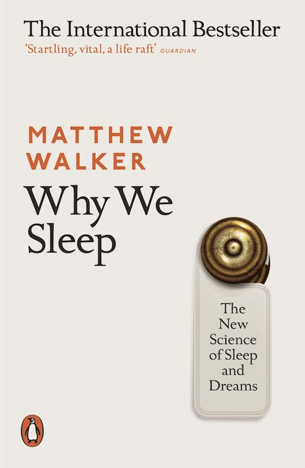

## Introducing the KOPI Book CLUB!

As an Osteopath, I specialise in the bio-mechanics of the beautiful human body. I am the eternal student of the body, an absolute privilege.

Over the next few months, I’m going to be sharing some of my recommended reads that I believe will help you better understand and nurture your physical body. I hope you enjoy reading them, and if you have any books to suggest, I would be very interested to [hear about them](mailto:info@kibworthosteopaths.co.uk).

### Book Review: Why We Sleep, Matthew Walker.

---

*“Within the space of 100 years, human beings have abandoned their biologically mandated need for adequate sleep – one that evolution spent 3,400,000 years perfecting in service of life-support functions. As a result, the decimation of sleep throughout industrial nations is having a clear impact on our health, our life expectancy, our safety, our productivity, and the education of our children.”*

\- Matthew Walker, Why We Sleep (page 337).

---

The importance of sleep is not routinely taught. Thus, it is not understood by society, governments, companies or individuals. As a developed nation, we admire those who seem to ‘function’ on minimal hours of sleep. The dangers to these individuals are monumental in terms of their health, as well as the risk they pose to others (did you know that driving tired is more dangerous than driving under the influence of alcohol and or drugs?)

Understanding why we sleep is imperative, which we must instil in future generations. Matthew Walker (a neuroscientist), in his incredible book, Why We Sleep, shows us how good quality sleep (7-9 hours) per night can make us cleverer, more attractive, boost our health in literally life-changing ways, and increase happiness. Who wouldn’t want this – for free?

As an individual, a mother and an Osteopath, I can not recommend this book highly enough – it is no exaggeration when I say this book has quite literally changed my life for the better.

 

