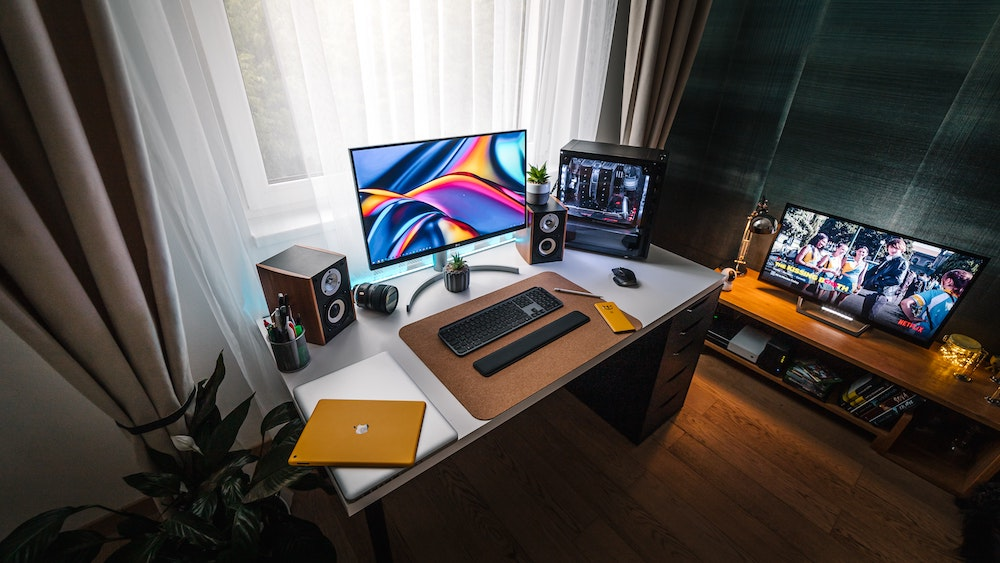

Whether you have always worked from home or doing so more recently, getting your set up right at home – and in an office - is really important. A home office is great, as is a company office – but not everybody has the space in their home to accommodate this, and let us be honest, how many of us want a whacking great desk-top at our dining table?

Ergonomic advice is something Osteopaths give out a lot, as we see many injuries caused by the physical demands of working at a desk there are 3 main areas that frequently arise; so, in this blog I give a snapshot of the top tips and advice I give to patients in my treatment room.

<h3>Stiffness in the Spinal Column - and legs!</h3>

Sitting causes our hamstrings (the muscles in the back of the thigh) and our hip flexors (the muscles at the front of the hip joint) to shorten. When these muscles are shortened and therefore tight – they can cause a pull on the spine and pelvis – causing aches and pains (as well as predisposing our body to injury in exercise).

Stretching these muscles are important – be it an isolated and deliberate stretch that has been prescribed to you by someone like me, or with global movement.

Isolated stretches are when you are stretching a specific muscle group in isolation. The main muscles that get shortened when working in a desk-based occupation are the hamstrings (the muscles at the back of the thigh) and the hip flexors (these muscles are at the front of the thigh).

Please contact me if you wish to learn more about safe and appropriate stretches for you to do – there is not one stretch that is ‘safe for all’ to do, so it is important that any prescribed/recommended stretches are individually designed.

<h4>Movement based stretching – take a walk!</h4>

Many of us have a commute to work – be it on foot/bike/car/train or maybe even plane! Whichever mode of transportation you use, I encourage you to replicate the physical part of your commute both at the start and end of your day; so, if part of your journey to and from work is a 20-minute walk, be it getting off the train, or a door-to-door commute, put this walk in your day. If a walk is not part of your day, make it so. Walking is good for the body as it promotes circulation, it gets your muscles and joints moving and it stimulates endorphins which aid concentration; and making this the start and end of work is great for your mind too.

<h4>Get up from your desk regularly!</h4>

How often do you get up from your desk? Guidelines are that we are up every 20-30 minutes for 2 minutes, then have 2 breaks of 15 minutes each, in the morning and one in the afternoon. A lunch break should be a minimum of 30 minutes – and should NOT be taken at your desk!

My best top tip is to MOVE regularly from your desk. Many people advise you to set alarms on your phone to remind you to move. I find this does not work. Simply because we all have our phones right by us, so how easy is it to just press snooze, and not actually get up? If you are at home, use your oven timer, or the egg timer, anything in a different room, so when it goes off you simply have to get up to reset it for your next movement break! If you are in an office, perhaps move your cup of tea away from you so you must get up to get it.

<h3>Head and Neck</h3>

Getting your workstation set up correctly is really vital for the neck – and your head. Sore and achy necks can often lead into headaches, as can too much screen time (so here is your reminder yet again to move regularly!) Stretching the muscles that get used in desk work is a great way to prevent injury.

I developed my 2 minute desk stretch routine to help people easily and safely stretch the muscles commonly shortened, or held static when working behind a desk -  a link to the video can be found <a href="https://www.facebook.com/kibworthosteo/videos/2656403381238515/" target="_blank" rel="noreferrer noopener">here</a>: PLEASE also read the following disclaimer at the end of the article.

If your job involves a lot of phone calls – I recommend a headset. These are gamechangers.

<h4>Laptops vs. Desktops</h4>

Laptops are literally the worst named device ever. Just because they are called laptops – do not work with them on your lap. Your head weighs 60lbs - this is a huge weight for the neck to support especially if you are looking down for prolonged periods of time! Work at a table, or desk. Look at getting yourself either a separate monitor or a laptop stand - I am not a fan of the tilting ones, as these are terrible for your elbows and wrists (see below). Your laptop needs to be level with your eyes and straight in front of you, not at an angle. Laptop stands that are a block to place your laptop on are great – or even a pile of amazon boxes will do. Worried about how to type and use your mouse with a laptop stand? Keep on reading!

<h3>Elbows and Wrists</h3>

Elbows and wrists actually have to work really hard when we are working at a computer – the kindest thing you can do for these structures is to consider getting a wireless keyboard and mouse– to go with the laptop stands we discussed above – this means you are not working in a cramped position, and allows you to rest your forearms on your desk/table – meaning your forearms are working from a rested position.

If you have pain on the top surface of your elbow – this could be Tennis elbow. One common cause of tennis elbow in desk workers is mouse work. My top tip here is to get a vertical mouse – these can be picked up easily online. The vertical mouse changes the orientation of the wrist and forearm, giving the tendons that attach to the lateral epicondyle a rest – so stopping the pull on the bone that causes tennis elbow.

Wrist rests (gel ones in particular) are helpful if you suffer from achy or arthritic wrists. Again, these can be picked up really easily online. 

<h3>Posture</h3>

If your desk set up is right, your posture should be naturally ‘right’. The best way to avoid working in a ‘bad’ posture is to move regularly! However, the right chair will also help with this. There is not one magic chair that I can recommend, and if you are working from home an office chair may not fit in your house. There are lots of lower back (lumbar) supports online that you can get that fit onto a dining chair – I am more than happy to advise on these on an individual basis, please email me: <a href="mailto:info@kibworthosteopaths.co.uk">info@kibworthosteopaths.co.uk</a>

If you do have an office chair, make sure any arms on the chair do not prevent you from sitting close to your workstation as this will cause you to reach and or lean. If the chair arms are stopping you from reaching your desk, remove them! You also need to make sure the seat of the chair is not too long or short for you – this is an individual thing, so again email me for further tailored advice.

If like me you are petite and your feet struggle to reach the floor, pop a cushion on the floor so your feet contact this. It is important 2 feet are on the floor – flat as well, not tip toes. Sitting with your legs crossed is a massive NO! This is bad for pelvis mechanics and circulation to name two reasons not to do this!

Woking behind a desk is surprisingly physical and can be a huge ask of your body – It really is vital you get it right. If you would like any further advice, please do get in touch, I would be happy to tailor advice to you.

<strong>- Written by Emily Coombes (B'Ost Registered Osteopath - 7416)</strong>