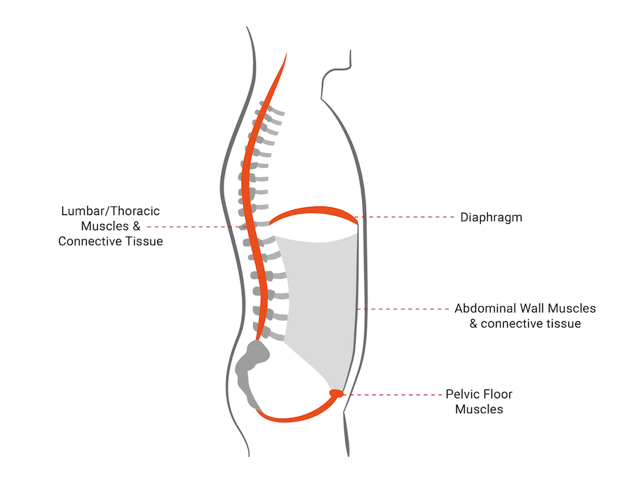

It’s no secret that I love exercise, it is a big part of my free time.

I often hear in the clinic that people feel it is too late to start exercising – sometimes patients think they are “too old” or too injured, or too much time has passed from the event to where they are now.

None of this is true.

We know from extensive research that exercising in later years (yes, even with arthritis) creates low-level inflammation – this may sound bad, but it is not.

Our amazing body cannot differentiate between old inflammation (from arthritis, for example) and new inflammation (which could be caused by exercise) – it just sets about healing it. This is why keeping arthritic joints still is only sometimes a good thing.

We also know that whether you’ve been exercising for 50 years or 5 weeks, your body will get HUGE benefits—and ultimately be in better health.

I adore all aspects of my work, but I am massively passionate about rehabilitating women post-birth and pre/post-menopause.

An example of a common presentation is women who have had a baby a good few years ago, and they’ve been putting up with pelvic floor issues, weak core, and then their lower back has become sore as well – and that is the last straw.

Or post-menopausal ladies who are noticing they just don’t feel as strong as they once did. A lot of the physical symptoms also result in low confidence, and this breaks my heart as I do believe in self-love, care and prioritising YOU.

The good news is, it is not too late!

Your body is incredible and will always respond to what you give it—eat a banana, get some energy, do enough core work, and strengthen your abdominals. However, it is really important that the rehabilitation is correct and complete.

Some patients are doing pelvic floor rehabilitation, but things are still not right, or they are running and experiencing urine leaking. This is why it is essential to consider the cylinder (your torso) of your body as a house and address all of it, not just one bit.

The foundations of your house are your pelvic floor and gluteal muscles (muscles of the bottom). The front of your house is your abdominals; the back of your house is your lower back (lumbar spine) and surrounding muscles, and the roof of your house is your diaphragm. These structures need addressing and rehabilitation work to ensure a good, wholesome, and dynamic approach to making this area functional and strong.

Rehabilitation work in four areas may seem like a lot, but it is not. A few specific exercises (done regularly) make a huge difference and become a way of moving that ultimately becomes second nature.

### Let's look at some now!

These exercises are the fundamentals that I always teach, and once they are in place, the sky is the limit.

- Pelvic floor - this app is amazing, and I recommend it to all: [Squeezy](https://squeezyapp.com/)
- Core - This a great core foundations video, focussing on the abdominal draw seated and kneeling.

    <iframe width="560" height="315" src="https://www.youtube-nocookie.com/embed/TWO59bVSIvI?si=wsXzklmBkm5Msl3u" title="YouTube video player" frameborder="0" allow="accelerometer; autoplay; clipboard-write; encrypted-media; gyroscope; picture-in-picture; web-share" referrerpolicy="strict-origin-when-cross-origin" allowfullscreen></iframe>

- Lumbar spine – This video focuses on strengthening the lumbar spine with clam exercises.

    <iframe width="560" height="315" src="https://www.youtube-nocookie.com/embed/kOVvHnjudOI?si=8R15lSw9MKdarB-7" title="YouTube video player" frameborder="0" allow="accelerometer; autoplay; clipboard-write; encrypted-media; gyroscope; picture-in-picture; web-share" referrerpolicy="strict-origin-when-cross-origin" allowfullscreen></iframe>

- Diaphragm – This video will help improve breathing and strengthen the diaphragm.

    <iframe width="560" height="315" src="https://www.youtube-nocookie.com/embed/4W5PnamaFZc?si=16qvNnGvYjYjL9zQ" title="YouTube video player" frameborder="0" allow="accelerometer; autoplay; clipboard-write; encrypted-media; gyroscope; picture-in-picture; web-share" referrerpolicy="strict-origin-when-cross-origin" allowfullscreen></iframe>

Make your physical goals BIG. You can do hard things, and I am here to help you if you need it or have a few questions about your body. Please do just ask.

---

### For more information
- [Blog: Self care](/blog/self-care/)
- [Blog: Self care is not selfish](/blog/self-care-is-not-selfish/)
- [Book review: The 5am Club](/blog/book-review-5am-club/)